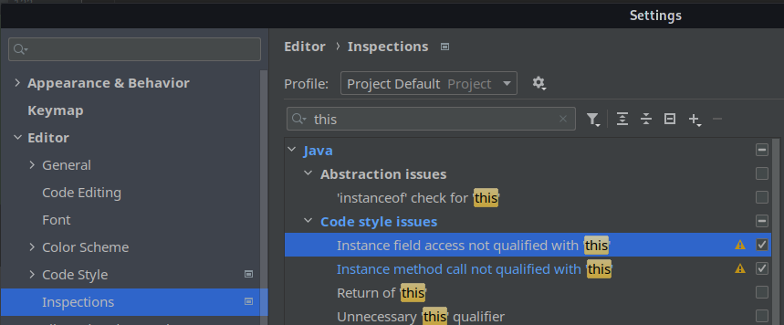
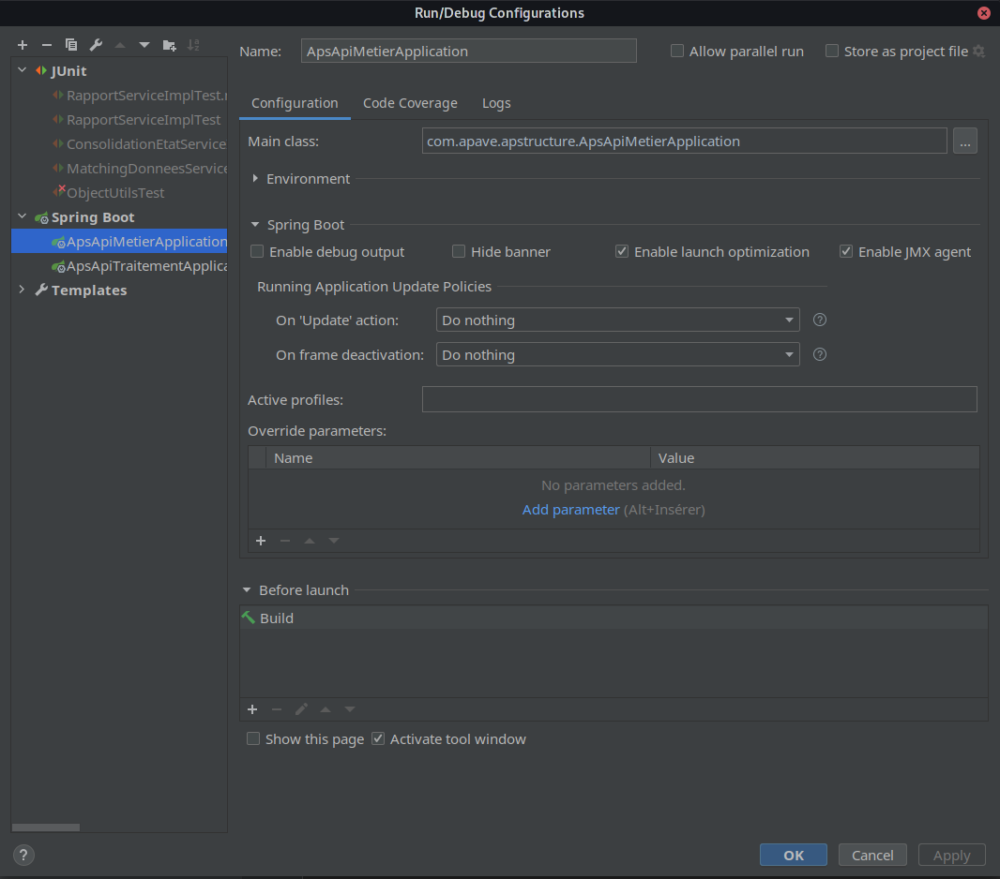
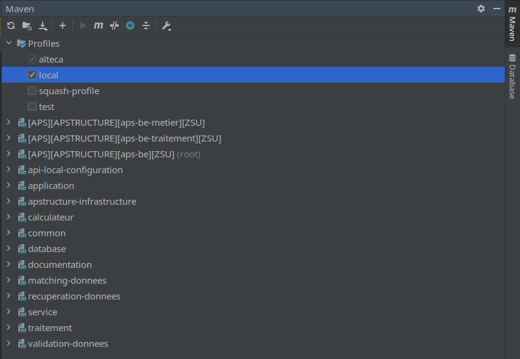
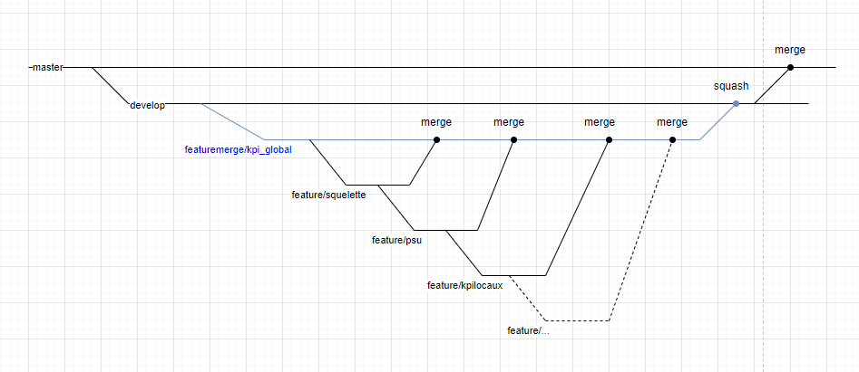
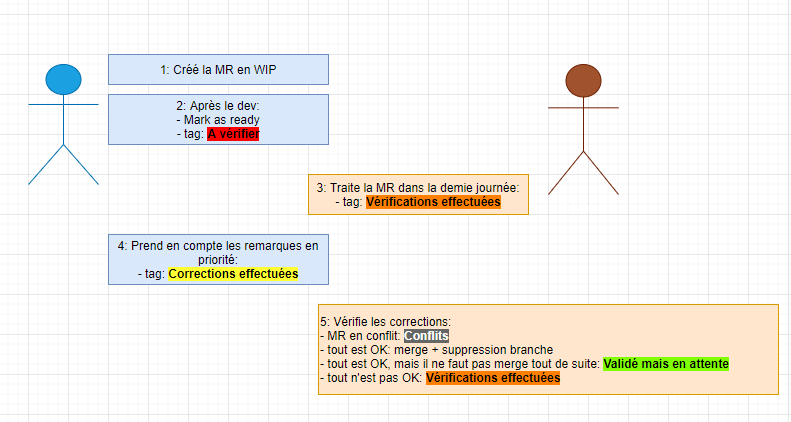

# Bonnes pratiques de développement backend

## Sommaire
|N°  |Question  |
|--|--|
| 1 | [Comment sont réparties les couches applicatives ?](#couches-applicatives) |
| 2 | [Quel est le git flow du projet ?](#git-flow) |
| 3 | [Comment se déroule le processus de validation d'une Merge Request ?](#merge-request) |
| 4 | [Doit-on déclarer les DTO finaux ?](#dto-finaux) |
| 5 | [Comment nommer ses tests unitaires ?](#nommage-tests-unitaires) |
| 6 | [Comment implémenter une requête SQL native ?](#sql-natif) |
| 7 | [Quelle est la limite de paramètres à une méthode et comment les valider ?](#paramètres-des-méthodes) |
| 8 | [Comment nommer mes URLS lors que je créé un controller ?](#url-dans-les-controllers) |
| 9 | [Comment lancer le backend sans IDE ?](#lancer-le-backend-sans-ide) |
| 10 | [Comment lancer le backend dans un IDE ?](#lancer-le-backend-dans-un-ide) |
| 11 | [Quelles sont les règles d'écriture des services ?](#règle-écriture-des-services) |
| 12 | [Comment implémenter des requêtes basiques ?](#utilisation-de-l-annotation-query) |
| 13 | [Comment implémenter un repository custom ?](#custom-repository) |
| 14 | [Doit-on utiliser systématiquement le mot-clé 'this' ?](#utilisation-de-this)
| 15 | [Quelles sont les conventions de nommage dans la base de données ?](#conventions-base-de-donnees) |


### Détails
### Utilisation de 'this'
Le mot-clé `this` doit être utilisé systématiquement pour tous les accès à des variables ou des méthodes d'instance.
Pour éviter les oublis, il est recommandé d'activer les deux warnings suivants dans intelliJ (ils sont désactivés par défaut) :


### DTO finaux
On évite:
```java
@Getter
@Setter
@Builder
class DummyDto {
	private String foo;
	private String bar;
}
```
On fait plutôt:
```java
@Getter
@Builder
class DummyDto {
	private final String foo;
	@Setter private String bar;
}
```
 **[⬆ Retour au sommaire](#sommaire)**
### Nommage tests unitaires
On respecte la règle de nommage:
```java
@Test
void nomMethode_given_donnees_entrantes_when_evenement_should_avoir_un_resultat() {
	// Utilisation d'hamcrest
	MatcherAssert.assertThat(something, is(somethingElse));
}
```

 **[⬆ Retour au sommaire](#sommaire)**
### Sql natif
On évite
```java
private static final String CONST1 = "xxxxxxxxxxxxxxxx";
private static final String CONST2 = "xxxxxxxxxxxxxxxx";
private static final String CONST3 = "xxxxxxxxxxxxxxxx";
private static final String CONST4 = "xxxxxxxxxxxxxxxx";
private static final String CONST5 = "xxxxxxxxxxxxxxxx";

String query = CONST1+CONST2+CONST3+CONST4+CONST5;

this.jdbc.query(query...);					
```

On fait plutôt une classe utilitaire qui contient les constantes :
```java
@AllArgsConstructor(access = AccessLevel.PRIVATE)
public class MonQueryBuilder {
    private static final String CONST1 = "xxxxxxxxxxxxxxxx";
    private static final String CONST2 = "xxxxxxxxxxxxxxxx";
    
    public static String maQuery(){
        return CONST1 + CONST2;
    }
}
```
Et qu'on appelle pour générer la query :
```java

Query query = MonQueryBuilder.maQuery();
this.jdbc.query(query...);					
```

 **[⬆ Retour au sommaire](#sommaire)**
### Paramètres des méthodes
On évite
```java
void maMethod(var param1, var param2, var param3, var param4, var param5) {
	if (null == param1 || null == param2 || ...) {
		// do something
	}
}
```

On fait plutôt
```java
class MonDto {
	@NotNull var param1;
	@Min(value=10) var param2;
}


/* Utilisation d'un response en entrée à partir de 4 paramètres
 ou si besoin de validation de données. */
void maMethod(MonDto params) {
	ValidationFactory.valid(params); 
}
```
 **[⬆ Retour au sommaire](#sommaire)**

### URL dans les controllers
Ne pas oublier le /interne qui est nécessaire pour le routage dans l'environnement Apave.
```java
@RestController
@RequestMapping("/interne/mesressources")
class MonController {
	@NotNull var param1;
	@Min(value=10) var param2;
}
```
**[⬆ Retour au sommaire](#sommaire)**

### Lancer le backend sans IDE
* [X] Installer le JDK8: trouvable [ici](https://adoptopenjdk.net/?variant=openjdk8&jvmVariant=hotspot)
* [X] Renseigner la variable d'environnement JAVA_HOME et la rajouter dans le Path avec %JAVA_HOME%/bin
* [X] Cloner le back et se placer sur la branche souhaitée
* [X] Ouvrir un terminal et suivre les étapes suivantes
```bash
> cd chemin\vers\le\projet\aps-backend
# lancer la compilation du projet, après avoir fait un pull
> .\mvnw.cmd -Ptest -DskipTests clean install
> cd .\application\aps-api-metier\
> .\..\..\mvnw.cmd -Ptest spring-boot:run

```
**[⬆ Retour au sommaire](#sommaire)**

### Lancer le backend dans un IDE 
(exemple avec intelliJ)
* [X] Ne pas utiliser de profil Spring
* [X] Utiliser les profiles maven à la place

#### Profils utilisables
* **test** : Utilise une BDD éphémère h2 "in-memory" vive qui est effacée à chaque extinction de l'application.
* **local** : Utilise une BDD h2 "file" stockée dans le répertoire .h2 à la racine du projet.

#### Exemple de configuration springboot sous intelliJ
Il est important que la case "active profiles" soit vide.

#### Exemple de configuration maven sous intelliJ

**[⬆ Retour au sommaire](#sommaire)**

## Règle écriture des services
Si la méthode fait appel à un repo, elle doit être annotée de @Transactional en suivant les règles suivantes:

Dans le cas où la méthode ne fait que des lectures en bases, préciser que la transaction est readOnly.
Dans le cas d'un service ne faisant pas que de la lecture, on met le readOnly = false (même si c'est la valeur par défaut, pour faciliter la compréhension du prochain qui lit le code), et on précise la propagation.
Les principales propagations sont:
- REQUIRED: Utilisation de la transaction courante ou création d'une nouvelle si aucune n'est en cours.
- MANDATORY: Utilisation de la transaction courante. Si aucune n'est en cours, throws une exception.
- REQUIRES_NEW : Créer forcément une nouvelle transaction pour l'exécution de la méthode. 
```java
@Service
@AllArgsConstructor
class ServiceImpl implements Service {
	
	private MonRepo repo;
	
	@Override
	@Transactional(readOnly = true)
	public MonDto faireQuelqueChoseEnLecture(MonAutreDto dto) {
		return this.repo.lireQuelqueChose(dto);
	}

	@Override
	@Transactional(readOnly = false, propagation = Propagation.REQUIRED)
	public void ecrireQuelqueChose(MonDto dto) {
		return this.repo.ecrireQuelqueChose(dto);
	}
}
```

**[⬆ Retour au sommaire](#sommaire)**

## Utilisation de l annotation query

Pour les requêtes simples, il est possible de mapper directement le résultat dans un DTO dans l'annotation @Query de spring.
Pour éviter les injections SQL, les paramètres doivent être mis dans la requête via des `:param`puis valorisés avec l'annotation @Param.
Retourner un optional ou non est au choix du développeur.
```java
@Query("SELECT new com.apave.apstructure.common.dtoser.UtilisateurDto(u.id, u.identifiant, u.role) " +
 "FROM UtilisateurEntity u WHERE u.id = :id")
 Optional<UtilisateurDto> findByIdentifiant(@Param("id") Long id);
 ```

**[⬆ Retour au sommaire](#sommaire)**


## Custom repository
Quand la requête est trop complexe pour être mise en @Query, ou qu'on atteint les limites de JPA (ex: les fonctions fenêtrées), instancier un repository custom se fait de la manière suivante:
```java
// Il est important que le nom de l'interface se termine par Custom
public interface MonRepoCustom {
	
	/**
	 * Rechercher de manière complexe
	 * 
	 * @param params paramètres de la recherche
	 * @return DTO résultat de la recherche
	 */ 
	MonDto rechercherDeManiereTresComplexe(MesParametres params);
}

@Repository
public interface MonRepo extends JpaRepository<MonEntity, MaPk>, MonRepoCustom {
	
}

/* Ici aussi le nom de l'implémentation finissant par CustomImpl est important pour que Spring le retrouve.
On étend l'AbstractRepoCustom pour bénéficier des méthodes utilitaires généralisées. */
@AllArgsConstructor
public class MonRepoCustomImpl extends AbstractRepoCustom implements MonRepoCustom {
	// si nécessaire, on injecte le jdbc comme ceci
	private final JdbcTemplate jdbc;
	
	@Override
	public MonDto rechercherDeManiereTresComplexe(MesParametres params) {
		// fais quelque chose de compliqué.
	}
}
 ```

**[⬆ Retour au sommaire](#sommaire)**

## Couches applicatives
```bash
-aps-backend
	|-application
		|-api-local-configuration
		|-aps-api-metier
		|-aps-api-traitement
	|-common
	|-config
	|-database
	|-documentation
	|-gestion-documents
	|-h2data
	|-infrastructure
	|-notification
	|-service
	|-traitement
		|-calculateur
		|-matching-donnees
		|-postcalcul
		|-recuperation-donnees
		|-validation-donnees
	    
```
### application
Projet contenant les applications bootables
- **api-local-configuration**: configurations uniquement pour un packaging local (notamment l'autorisation de l'accès à SwaggerUI et la console H2
- **aps-api-metier**: Application métier (_frontend for backend_). Elle sert des webservices pour le front-end. Ne contient que la configuration, les controllers et les consumers pour le messaging. Aucun code métier dans cette couche, tout doit être délégué à la couche service.
- **aps-api-traitement**: Application pour le traitement des données. Comme l'API métier, ne doit contenir que la couche webservice, et doit déléguer le travail à la couche service.

### common
Projet contenant les ressources communes à toute l'application.
On y trouve les exceptions, les DTOs organisés en sous-packages fonctionnels et des utilitaires.

### config
Dossier contenant les configurations externalisées pour le projet. Elles sont basées sur les profils **maven** et non pas spring pour rentrer dans les standards apave. Pour les activer, activer le bon profil dans les configs maven.

### database
Projet contenant les changelogs de liquibase, et uniquement cela.

### documentation
Projet contenant la documentation du projet. On y trouve la doc de développement, les différents UML de conception dans le repertoire plantuml, ainsi que la doc apave.

### gestion-documents
Module de stockage des documents

### h2data
Dossier généré contenant le fichier de base de données. En cas de soucis liquibase au démarrage, ne pas hésiter à supprimer ce dossier pour re-générer la base proprement.

/!\ Ne sera pas présent en cas de démarage sur un oracle.

### infrastructure
Projet JPA, il contient la config JPA, ainsi que les repositories et les entités.

### notifications
Module qui gère le métier et la technique des notifications de l'appli. N'y acceder que par messaging.

### service
Projet contenant la couche business de l'application. Le code présent dans ce projet est le seul pouvant accéder à la couche infrastructure. Ce code doit être testé (à minima unitairement, de manière intelligente et efficace).
On trouve également les mappers dans cette couche, qui doivent également être testés unitairement.

### traitement
Projet parent des différentes parties du batch de traitement des données sercel.

### calculateur
Projet contenant le calcul d'un état. Kpi locaux, macs, comacs et kpi global. C'est la dernière étape du batch. Seul module autorisé à effectuer un calcul et l'enregistrer.

### matching-donnees
Projet contenant la mécanique d'enrichissement des données d'un état validé suite à son intégration. Elle permet de trouver quelles données sont à utiliser dans les calculs ou non.

### postcalcul
Effectue des contrôles et actions après le calcul des états. Par exemple, passer les ouvrages en mode renforcé si les resultats sont mauvais.

### recuperation-donnees
Projet permettant la récupération et l'intégration des données depuis sercel. Seul module autorisé à appeler Sercel.

### validation-donnees
Projet permettant la validation des données intégrées depuis sercel. Va vérifier un ensemble de règles sur tous les états qui sortent de l'intégration et les place en erreur ou à matcher à la fin.

**[⬆ Retour au sommaire](#sommaire)**

## Git flow

* Branches
    * `Master` : c'est la branche pour la production
    * `develop` : c'est la branche par défaut
    * `feature/*` : ce sont les branches pour une nouvelle fonctionnalité
    * `featuremerge/*` : ce sont les branches regroupant plusieurs fonctionnalités
    * `bugfix/*` : ce sont les branches pour corriger un bug

Les branches doivent être impérativement préfixées selon leur utilisation comme décrit ci-dessus.  




Les fonctionnalités (`feature` ou `featuremerge/`) ne se fusionnent pas directement sur la branche `master`, seul la branche `develop` se merge sur `master`.    
Les commits des branches sont fusionnés en un seul commit (squash) seulement lorsqu'on les merge sur `develop`, on ne squash pas les commits sinon.

**[⬆ Retour au sommaire](#sommaire)**

## Merge request

Voici les étapes du déroulement du processus de validation d'une merge request :
  * 1 : La merge request doit être créée en WIP (en ajoutant le préfixe `WIP:` ou `Draft:`) dès le 
    début, avant même d'avoir commencé à programmer ou au moins lors du premier commit.
  * 2 : Une fois que la programmation est terminée, le préfixe `WIP:` ou `Draft:` est supprimé 
    (le bouton `Mark as ready` fait cela sur GitLab) et la branche est munie du tag `A vérifier`.
  * 3 : La branche est vérifiée par un pair dans la demi-journée qui remplace le tag `A vérifier` 
    par `Vérifications effectuées`. Néanmoins il est possible de commenter et traiter la merge 
    request sans modifier le tag par `Vérifications effectuées` dans le cas où une relecture 
    supplémentaire est nécessaire.
  * 4 : Dès que la vérification de la merge request est effectuée, le développeur prend en 
    compte les remarques (les corrige et/ou répond aux commentaires) et remplace le tag
    `Vérifications effectuées` par `Remarques corrigées`.
  * 5 : 
    - Les corrections sont vérifiées par le pair concerné qui peut merger la branche, puis la
    supprimer si la MR est valide. 
    - Dans le cas contraire, il remet le tag `Vérifications effectuées` et ajoute éventuellement 
      de nouvelles remarques sur la MR invalide qui devrons être retraitées par le développeur.
    - Si la branche est en conflit et ne peut pas être mergée, il peut ajouter le label `Conflits` 
      pour que le développeur merge la branche cible sur sa branche et règle les conflits.
    - Si la branche est valide mais elle ne doit pas être mergé tout de suite, on la tag par 
    `Validé mais en attente`

Voici un schéma récapitulatif :  



**[⬆ Retour au sommaire](#sommaire)**

## Conventions base de donnees

### Noms de tables
- Tables de références: REF_xxxx
- Tables de données: T_TRI_XXXX
  - TRI est le trigramme de la table. C'est une combinaison des premières lettres du nom de la table. *(Ex: T_PSU_**P**OLITIQUE_**SU**RVEILLANCE)*
- Tables relationnelles: R_TRI_TRO
  - TRI et TRO sont les trigrammes des tables entre lesquelles la table fait la relation *(Ex: R_USR_OAT)*
  
### Colonnes
- ID techniques: TRI_ID
- Foreign key: TRO_ID
  - On indique le nom exact de la colonne cible de la FK *(Ex: Dans la Table T_TRI, le champ TRO_ID est une FK vers la colonne TRO_ID de la table T_TRO)*
- Colonnes de données: TRITY_nom
  - On commence par le trigramme de la table, puis le **ty**pe de la donnée. *(Ex: OATVA_IDENTIFIANT est une colonne de la table T_OAT_.., de type **VARCHAR2**)*
  - Voici les abréviations pour les types:
    - VA: varchar2
    - NB: number (peut importe la précision)
    - DT: pour date, timestamp)
    - BO: pour les booléens

### Contraintes
- Primary key: T_TRI_xxxx_PK
    - Nom de la table suivi de _PK
- Foreign key: FK_TRI_TRO
  - TRI est la table sur laquelle est placée la fk, tro la table cible

### Indexes
Pour rappel, les indexes doivent être placés explicitement dans le namespace des indexes.
- Index pour FK: IDX_TRI_TRO
  - Même nom que la FK, en remplaçant FK par IDX
- Index custom: *IDX_TRI_COL1_COL2_COL3* succeptible de changer, le cas n'a pas encore été rencontré.


**[⬆ Retour au sommaire](#sommaire)**
