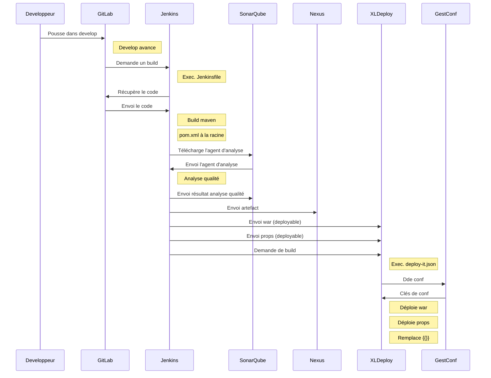

## Rappel sur la PIC

La PIC actuellement en place ne va pas jusqu'au déploiement, sauf sur les environnements de développement.

La "nouvelle" (ou "future") PIC irra jusqu'au déploiement automatique sur les environnements.

### Les participants

Le **développeur** est la personne chargée de coder l'application :). Il utilise git pour versionner son code source.

**GitLab** est un serveur Git, mis à disposition par Apave. Il héberge le code versionné. Il est accessible à l'adresse : 

    http://gitlab.apave.grp/

**Jenkins** est le serveur d'intégration continue. Il est prévenu par GitLab lorsqu'un dépôt fait avancer sa branche "develop". Il se charge alors de récupérer le code de ce dépôt, puis de le constuire en suivant les instructions du fichier "Jenkinsfile", qui doit être situé à la racine du projet.

    http://jenkins-pic.apave.grp:7792/

*SonarQube" est un serveur chargé de mémoriser les résultats de l'analyse du code de chaque projet juste avant la fin de chaque build. L'outil d'analyse est exécuté par Jenkins lui même, mais le résultat de l'analyse est envoyé dans le serveur SonarQube.

    http://sonar-pic.apave.grp:9000/

**Nexus** est un serveur d'artefact. Il est là pour mémoriser toutes les bibliothèques dont le développeur a besoin pendant son développement. C'est à lui que s'adressent des clients comme maven ou npm. Aujourd'hui, les wars sont déployés dedans, mais à terme, seules les bibliothèques (angular et/ou java) auront besoin de remonter dedans. Il est rempli par Jenkins à la fin de chaque build.

    http://nexus-pic.apave.grp:8081/

**XLDeploy** est un outil chargé d'installer chaque projet sur chaque environnement. Il est composé d'un serveur, permettant de le configurer, et d'un agent, installé sur chaque serveur. A la fin de chaque build, Jenkins lui envoi les "deployables". Ces derniers peuvent être des fichiers "war" (qui ne varient pas d'un environnement à l'autre), ou des zip contenant des fichiers de propriétés (qui doivent être adaptés à chaque déploiement). Après chaque déploiement, XLDeploy va remplacer les "moustaches" (clés entre double accolades) par leur valeur définie dans GestConf.

    https://xldeploy-pic.apave.grp/

**GestConf** est un outil Apave qui permet de définir les valeurs de chaque clé sur chaque environnement. Mais cette fonctionnalité est aussi présente dans XLDeploy. Il a été modifié pour ajouter un bouton permettant d'envoyer les clés GetConf dans XLDeploy.

### Pour s'interfacer

Pour s'interfacer avec la PIC, il faut donc :

- Demander (et obtenir) un repo sur GitLab (RTA/CTA)
- Demander (et obtenir) un Job sur Jenkins, en lien avec le repo GitLab
- Déclarer les environnements dans GestConf
- Ecrire le Jenkinsfile (ou prendre celui du Starter Kit)
- Créer les clés dans GestConf (pour chaque env), et les exporter dans XLDeploy
- Séparer la configuration dans un "déployable" à part.
- Ecrire le deploy-it.json
- Ne pas travailler directement dans "develop" ! Utilisez des merge requests !

ATTENTION: L'analyse Sonar n'est pas bloquante. Gardez un oeil dessus. Ou encore mieux, installez un plugin Sonar local qui vous permettra d'avoir une analyse en temps réel.

### Diagramme de flux

