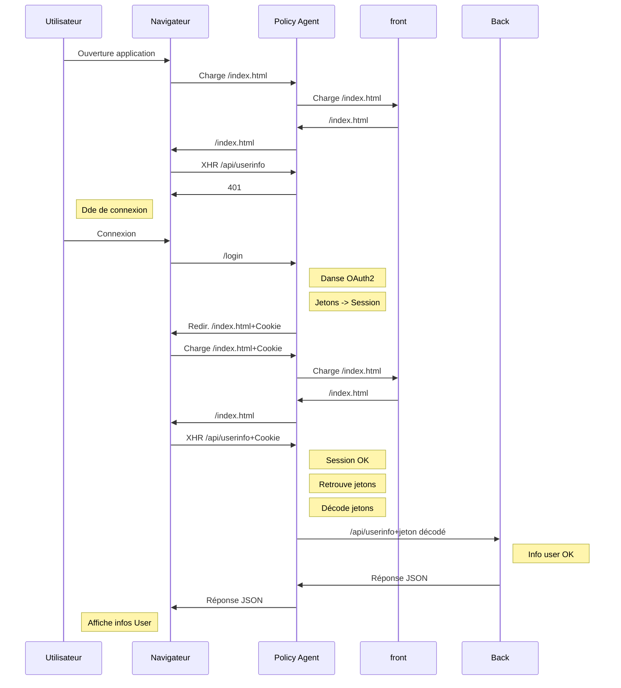
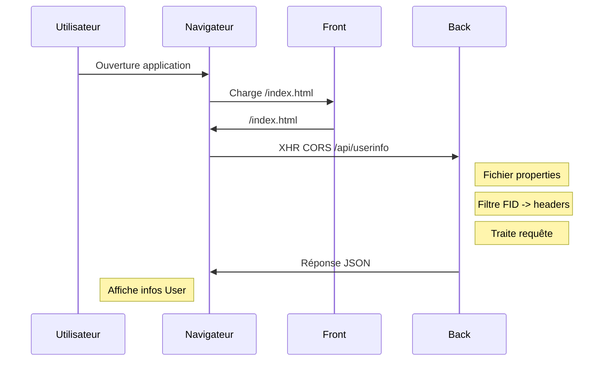

La FID Apave repose sur une infrastructure OAuth2 basée sur un serveur KeyCloak de JBoss. OAuth2 étant un protocole complexe, Apave a mis en place une architecture permettant aux applications de ne pas avoir à se soucier de cette implémentation, ou du moins d'en simplifier l'utilisation.

Reportez vous à la présentation de la FID chez Apave pour plus de détail.

FIXME: Ajouter le lien.

# Environnement Apave : Le Policy Agent

## Règles de reverse proxying

Le front et le back de l'application sont tous les deux reverse proxyfiés par un serveur Apache : Le Policy Agent. 

    Navigateur <-> Policy Agent <--> Backend  (Tomcat + webapp Java)
                                <--> Frontend (Httpd + Angular)

Quand un navigateur demande à accéder à une resource commençant par '/api/', le Policy Agent la retransmet au serveur Tomcat backend. Et quand il cherche à accéder à une autre resource (ne commençant donc pas par /api), le Policy Agent la transmet au serveur Httpd frontend.

Par exemple, un appel à '/api/monservice' sur le Policy Agent, transmet la requête au serveur Tomcat en utilisant le chemin '/la-webapp-du-projet/rest/interne/monservice'. Et un appel à '/index.html' est transmise (sans transformation, en fonction de la configuration) au serveur Httpd.

Notez bien que seuls les services rest présents dans /interne sont reverse proxyfiés. Comme nous le verrons plus tard, /interne est aussi la seule racine a être protégée par le filtre FID. En effet, seuls les services utilisés par le front sont protégés par la FID, cette dernière ne prenant pas en compte la communication back to back. 

## Rupture de protocole

Le Policy Agent se charge de la rupture de protocole : Il reçoit des requêtes en HTTPS, mais transmet des requêtes en HTTP.

## Authentification des utilisateurs

La fonctionnalité principale du Policy Agent est de jouer la danse OAuth2. Cette danse est plutôt complexe, mais grâce au module apache mod\_auth\_oidc, pour le développement du back, le processus est grandement simplifié: Une fois l'utilisateur authentifié par le front, toutes les requêtes reverse proxyfiées par le Policy Agent vers le serveur Tomcat se voient ajouté un certain nombre d'en têtes http supplémentaires qui contiennent des informations sur l'utilisateur courant.

Pour éviter à chaque projet d'interpêter lui même toutes ces en tête, Apave fourni un premier filtre qui - une fois mis en place - défini un objet "Principal" dans la requête http (au sens javax.servlet.HttpServletRequest). Cet objet contient entre autre toutes les informations GestAcces de l'utilisateur. Il peut être injecté via un @Context JAX-RS standard, permettant ainsi au service Rest de savoir qui est en train de l'appeler.

La même biliothèque fourni un second filtre (au sens JAX-RS cette fois) qui est chargé de vérifier la présence d'annotaions sur les méthodes Rest. Grâce à ce second filtre, le développeur pourra positionner facilement la liste des rôles GestAcces que doit posséder l'utilisateur pour appeler telle ou telle méthode.

Notez qu'en l'absence d'information dans GestAcces pour l'utilisateur connecté, le premier filtre forcera un retour 401 "Not Authorized".

### Définition du filtre FID

Dans le starter kit, le filtre est défini dans le fichier "module-starter-kit-server/src/main/webapp/WEB-INF/web.xml". En voici un extrait

    <filter>
      <filter-name>FIDFilter</filter-name>
      <filter-class>com.apave.stsi.generic.security.filter.FIDFilter</filter-class>
    </filter>
    <filter-mapping>
      <filter-name>FIDFilter</filter-name>
      <url-pattern>/rest/interne/*</url-pattern>
    </filter-mapping>

Notez bien la présence de "/rest" qui doit être cohérent avec votre déclaration de la servlet Jersey (reportez vous au chapitre correspondant pour plus de détail). Notez aussi que le filtre est appliqué uniquement aux services rest liés à /interne (c'est à dire aux services utilisés par le front Angular). Ce sont en effet les seuls qui sont reverse proxyfiés par le Policy Agent.

Comme indiqué plus haut, ce filtre est chargé de renseigner le Principal de la requête à partir des informations présentes dans les headers HTTP (envoyés par le Policy Agent)

Pour que le développeur puisse en plus définir les rôles que doit avoir l'utilisateur grâce à des annotations sur chaque méthode, il faut en plus définir un filtre JAX-RS. Pour cela, il suffit d'implémenter l'objet suivant :

    package com.apave.starterkit.rest;
    
    import javax.ws.rs.ext.Provider;
    
    import com.apave.stsi.generic.filter.BaseFIDAuthorizationFilter;
    
    @Provider
    public class FIDAuthorizationFilter extends BaseFIDAuthorizationFilter {
    
    }

Aucun code supplémentaire n'est nécessaire.

### Injection de l'utilisateur courant

Le starter kit fourni le end point "/userinfo", défini dans la classe "com.apave.starterkit.rest.interne.UserInfoRest". C'est un bel example pour voir comment se faire injecter l'utilisateur courant.

Notez que cette classe est nécessaire pour faire fonctionner une application front basée sur le starter kit angular. Cette dernière va en effet l'utiliser pour déterminer qui est l'utilisateur courant.

    @Path("/")
    @Produces(MediaType.APPLICATION_JSON)
    @Api(value = "UserInfo")
    public class UserInfoRest {
    
        @GET
        @Path("userinfo")
        @Produces(MediaType.APPLICATION_JSON)
        @ApiOperation(value = "Récupérer les informations sur l'utilisateur actuellement connecté")
        @ApiResponses(value = {
            @ApiResponse(code = 200, message = "Succès")
        })
        public FIDUserInfo userInfo(@Context SecurityContext securityContext) {
            return (FIDUserInfo) securityContext.getUserPrincipal();
        }
    }

Notez l'injection de l'objet SecurityContext via un @Context JAX-RS. La méthode getUserPrincipal() retourne ensuite le user principal, qui - lorsque le FIDFilter est présent - peut être casté en FIDUserInfo.

Reportez vous aux javadocs de cet objet pour avoir le détail des informations présentes à l'intérieur. Sachez simplement qu'on y retrouve - entre autre - toutes les informations GestAcces de l'utilisateur.

## Définir des droits sur une méthode Rest

La classe ExampleRest est une bon exemple: Elle défini que l'utilisateur doit posséder les rôles "READER" et/ou "EDITOR" pour accéder aux méthodes. En voici un exemple :

    @GET
    @RolesRequired(roles = {"READER"})
    public List<ExampleDTO> getAllExamples() {
    	return this.exampleService.getAll();
    }

Si le filtre JAX-RS a été mis en place (cf chapitre précdent), et que l'utilisateur ne possède pas le rôle GestAcces "READER", alors il obtiendra une réponse 401 lors de l'appel à cette méthode.

## Problématique CORS

De par sa présence, le Policy Agent permet de simplifier les appels CORS, qui ne sont plus nécessaires puisque le front et le back sont regroupés sous un même nom d'hôte.

La mise en place des en têtes CORS sera cependant nécessaire dans le cadre de l'environnement de développement local, là où il n'y a pas de Policy Agent. Mais ce sujet sera traité dans un chapitre dédié un peu plus loin.

## Lien front <-> back: Endpoint /userinfo

Le service Rest /interne/userinfo, implémenté par la classe "com.apave.starterkit.rest.interne.UserInfoRest" est indispensable au bon fonctionnement du front. Le starter kit Angular a besoin de connaître l'url lui permettant d'appeler ce service de manière à obtenir les informations sur l'utilisateur courant.

Son préfixe "/interne" garanti que le Policy Agent le reverse proxyfiera en "/api".

N'oubliez donc pas de bien le conserver !

## Diagramme de flux

Voici le diagramme de flux :

# Environnement Local: Pas de Policy Agent

Dans le cas d'un environnement de développement local, le développeur doit pouvoir se passer du serveur KeyCloak (le Policy Server) et du Policy Agent. 

Ce chapitre part du principe que tous les éléments nécessaires à un environnement Apave "standard", et décrit dans le chapitre précédent, ont été mis en place.

## Problématique CORS

Sur un environnement local, le code backend va s'exécuter dans un serveur Tomcat écoutant - par exemple - sur localhost, port 8080. Par contre, le code frontend sera exécuté via un "ng serve", toujours sur localhost, mais sur un port différent. En conclusion, sur un tel environnement, lorsque le front appelera le back, il fera des appels CORS.

Par défaut, le serveur Tomcat va refuser le requête "pre-flight". Le navigateur refusera donc d'exécuter la requête Rest. Pour le forcer à l'accepter, il faut ajouter un filtre supplémentaire dans le web.xml. Ce filtre est aussi fourni par le starter kit, au travers de la bibliothèque "apave-genric-filter".

Pour rappel, dans le starter kit, le fichier web.xml se trouve dans "module-starter-kit-server/src/main/webapp/WEB-INF/web.xml". Vous devez ajouter les lignes suivantes :

    <filter>
        <filter-name>CorsFilter</filter-name>
        <filter-class>com.apave.stsi.generic.filter.CORSFilter</filter-class>
    </filter>	
    <filter-mapping>
        <filter-name>CorsFilter</filter-name>
        <url-pattern>/rest/interne/*</url-pattern>
    </filter-mapping>

Comme pour le FIDFilter, notez bien la référence à "/rest" qui dépend de la racine à laquelle vous avez lié la servlet Jersey. Notez aussi la référence à "/interne" qui signifie que les en têtes CORS ne sont ajoutées qu'aux services dédiés au front.

### Considérations de sécurité

Ce filtre - utilisé pour le développement - envoi des en têtes CORS très ouvertes, qui pourrait ouvrir le service à des attaques XSS. 

Pour éviter ce problème, la sécurité est garantie par le Policy Agent qui - en même temps qu'il reverse proxyfie les requêtes - va nettoyer ces en têtes. 

## Filtre spécifique à la FID

Comme expliqué dans le chapitre précédent, pour que le code ai accès aux informations sur l'utilisateur courant, il faut mettre en place un filtre supplémentaire (nommé "FIDFilter"). Ce filtre utilise des informations passées par le Policy Agent dans des en têtes http pour associer un objet "Principal" à la requête http. Et enfin, il vérifie si l'en tête "Apave-profile" existe bien, et force un retour 401 si ce n'est pas le cas.

Dans un environnement de développement local, nous n'avons pas de Policy Agent, donc pas d'en têtes, donc pas de "Principal" et un retour 401 forcé en réponse de chaque appel... 

Pour remédier à ce problème, le FIDFilter a une fonctionnalité supplémentaire : Il vérifie qu'un fichier properties est présent dans le Classpath, et qu'il possède une clé "enabled" qui vaut "true". S'il existe (et est activé), le filtre va chercher à l'intérieur des **valeurs par défaut** pour les headers attendus. 

Par défaut, ce fichier properties doit se nommer "/fid-default-headers.properties", mais son nom peut être changé en utilisant le paramètre "default-headers-file" du filtre.

Pour récapituler, lors de la réception d'une requete http, le FIDFilter va :

- Charger le fichier properties (s'il est présent).
- Vérifier que le propriété "enabled" est à "true". Si ce n'est pas le cas, il fait comme si le fichier n'existait pas.
- Lorsqu'il va récupérer la valeur d'un header, et que ce header n'est pas défini, il prend sa valeur dans le fichier properties.
- Notez que si la clé "enabled" est à false, alors les headers ne seront pas passé, ce qui forcera une réponse 401 à chaque appel.

Ainsi, lorsque le front (hébergé par le "ng serve" sur un port donné) appelera les APIs backend (hébergée par le Tomcat local sur un autre port), ces dernières se comporteront comme si le Policy Agent avait passé les en têtes qui vont bien. Sauf que la définition de ces en têtes sera faite dans le fichier properties, permettant ainsi au développeur de le changer pour tester différents droits.

Notez que le filtre est capable de détecter une mise à jour de ce fichier. Vous pouvez donc l'éditer et le modifier en direct, sans avoir à relancer la webapp. 

Dans le cadre du starter kit, le fichier properties se trouve dans 

    starter-kit-properties/src/main/resources/fid-default-headers.properties

Mais votre Tomcat a du être configuré pour utiliser la version "compilée" (où les variables maven sont substituées par de vrais valeurs en fonction du profile maven activé). Le fichier que vous devez modifier est donc en réalité :

    starter-kit-properties/target/starter-kit-properties-bin/fid-default-headers.properties

N'oubliez qu'en cas de recompilation, ce fichier sera écrasé par celui de src/main/resources.

### Exemple de fichier properties

Le fichier fid-default-headers.properties doit donc avoir la forme suivante :

    enabled=true
    Apave-sub=un_identifiant_non_utilise
    Apave-email_verified=0
    Apave-name=Florian MALASSIGNE
    Apave-preferred_username=a3604455
    Apave-given_name=Florian
    Apave-family_name=MALASSIGNE
    Apave-email=florian.malassigne@apave.com
    Apave-jti=un_identifiant_jti
    Apave-exp=1556209985
    Apave-nbf=0
    Apave-iat=1556195585
    Apave-iss=https://policyserver.dev.apave.grp/auth/realms/apavedev
    Apave-aud=silemhygiene-dev
    Apave-typ=ID
    Apave-azp=silemhygiene-dev
    Apave-auth_time=1556193563
    Apave-acr=0
    Apave-profile={"roles": [{"code": "READER", "libelle": "Administrateur", "estDefault": 0, "estRestreint": 1, "perimetres": []}], "droits": [], "collaborateur": {"idCollaborateur": {"codeCollaborateur": "X3900114", "codeSociete": "0201", "matricule": "604455", "codeEntite": "A3"}, "estUtilisateur": true, "codeUtilisateur": "a3604455"}}

Le plus compliqué, c'est de générer le header "Apave-profile". Vous pouvez en obtenir une version en appelant l'URL (de dev uniquement) suivante : 

    http://gestaccessrvplus.dev.apave.grp:8081/GestaccesPlus-Service/apave/rest/v3/utilisateurs/<login>/applications/<code appli>

Ainsi, vous pouvez simuler la connexion de n'importe quel utilisateur. Bien sûr, rien ne vous empêche de définir la valeur que vous voulez, et ainsi de simuler des droits à un utilisateur alors qu'il ne les a pas dans le Gestacces de dev... Cette URL vous servira alors à avoir la "forme" du JSON attendu.

### Considérations de sécurité

Ce fichier peut poser des problèmes de sécurité sur un environnement de production. Le cas est plutôt tordu, mais il peut se produire si le Policy Agent n'envoie pas les en têtes, et que la propriété d'activation est déployée avec une valeur à "true".

Pour éviter ce cas, deux garde fous sont mis en place :

- Lors du déploiement par XLDeploy, ce fichier est supprimé. 
- Dans le projet contenant les propriétés de l'application (dans le répertoire /module-starterkit-properties), la configuration XLDeploy génère une propriété "enabled" qui est toujours à "false". Vous pouvez le vérifier dans le fichier "module-starter-kit-properties/src/assembly/filter-xldeploy.properties".

## Diagramme de flux

Le fichier fid-default-headers.properties pouvant être modifié en temps réel, sans relancer le serveur Tomcat, vous pouvez facilement tester une déconnexion en passant la propriété "enabled" à "false".