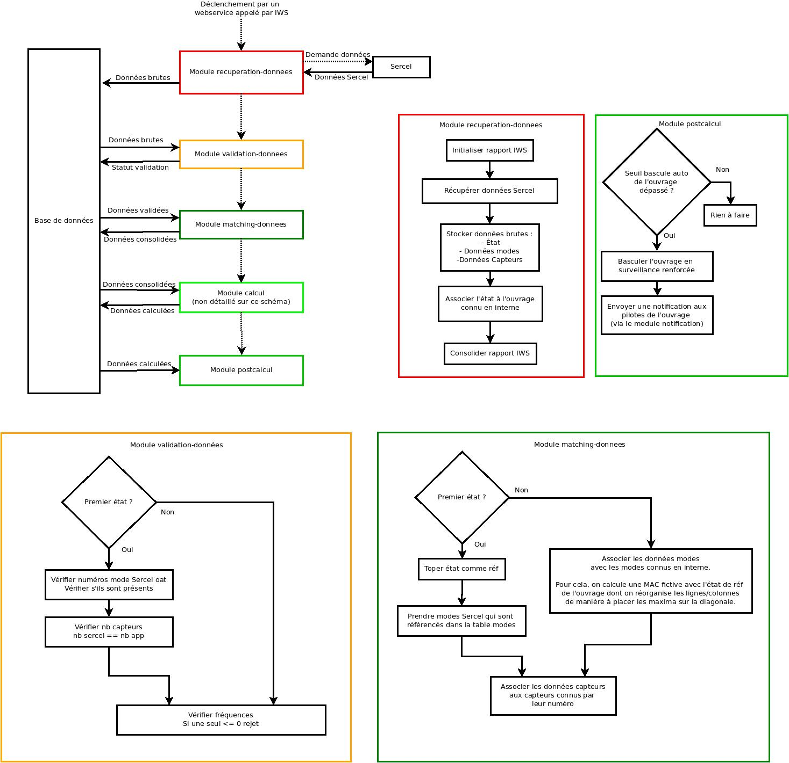

# Fonctionnement du batch de traitement

Le batch de traitement, déclenché la nuit, permet de récupérer les données chez Sercel, 
de les intégrer dans l'application et des les traiter.

Son fonctionnement est décrit par le diagramme ci-dessous : 

Le traitement exécute différentes étapes, décrites par le schéma en haut à gauche. Sur ce schéma, 
l'axe vertical représente l'ordre d'exécution des différents modules (de haut en bas) et l'axe horizontal 
représente les échanges de données.

## Modules
Chaque module représenté sur le schéma est un module java **indépendant** situé dans le module `traitement`.

Chaque module est totalement indépendant des autres et déclenché via un événement de messaging. De 
cette manière, si une étape du traitement échoue, les données issues des étapes précédentes restent
présentes en base de données pour un éventuel audit.

* Le batch est déclenché par un appel à un webservice réalisé par IWS.
* Le module de récupération de données appelle Sercel via webservices, pour déterminer pour chaque ouvrage
  si de nouvelles données sont disponibles. Si c'est le cas, ces données brutes sont récupérées et stockées
  sans aucun traitement en base de données.
* Le module de validation récupère les données brutes de l'étape précédente en base de données, puis
  effectue quelques contrôles sommaires sur leur cohérence.
* Le module de matching récupère en base de données les données validées, puis effectue une consolidation
  entre les données brutes et le paramétrage de chaque ouvrage dans l'application.
* Le module de calcul effectue les calculs de KPI, voir [la documentation détaillée](moteur-calcul.md)
* Le module de postcalcul permet d'effectuer certaines tâches annexes une fois toute la chaîne de traitement
  terminée, en vérifiant si le seuil de bascule automatique en surveillance renforcée d'un ouvrage 
  est dépassé, et en déclencheant des notifications aux experts.
