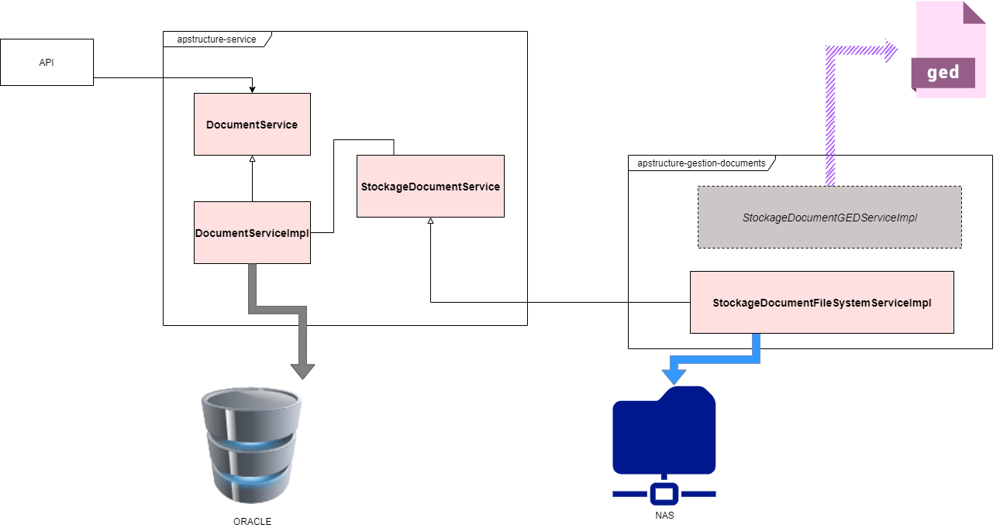

# Gestions des documents dans APS

La gestion des documents dans APS est basique. On stocke (upload) des documents et ils sont lus (
download) ensuite. Il n'y a pas de gestion de métas-données sur ces documents. A ce jour, les
documents sont stockés sur un NAS chez le client.

## Principes de base

La gestion des documents se fait en 2 parties:

- La partie "métier", qui s'occupe de stocker dans la DB l'information sur la présence des
  documents (T_DOC_DOCUMENTS).
- La partie "technique", qui s'occupe du stockage physique du document. Le contrat de celle-ci est
  défini par la partie métier, mais son implémentation se fait dans un module séparé. La partie
  métier n'a pas besoin de savoir quelle techno est utilisée pour stocker les fichiers. Ainsi, une
  nouvelle implémentation du StockageDocumentService pourrait théoriquement suffire à brancher une
  GED à la place du NAS par exemple.

Les documents stockés sont anonymisés. Ils sont nommés avec UUID stocké en base de données. Il en va
de même pour tous les dossiers de leur arborescence fonctionnelle (ouvrages, états).

## Comment sont stockés les documents provenant des utilisateurs ?

Les documents provenant des utilisateurs sont uploadés en multipart depuis l'api-metier. Pour le
download, le mime-type est calculé automatiquement, ou mis en octet-stream si non trouvé. (Ce qui
causera au navigateur de proposer le téléchargement de la pièce et pas d'ouverture).

Ces documents se trouvent dans le répertoire userfiles. Ils sont rangés dans un dossier représentant
l'ouvrage (t_oat_ouvrage_art.oatva_cle_document). Leur nom est stocké dans la table des documents (
t_doc_documents.docva_cle_documents).

## Comment sont stockés les images applicatives (spectres) provenant de Sercel ?

Les spectres provenant de sercel sont récupérés pendant le batch. Pour être sauvegardés, un fichier
vide est d'abord créé dans l'arborescence, puis rempli via un WS Sercel. En cas d'erreur, le fichier
est supprimé.

Ces documents se trouvent dans le répertoire apppicts. Ils sont rangés dans des dossiers
représentants successivement l'ouvrage et l'état (t_eta_etat.etava_cle_document).

## Comment activer ou désactiver la fonctionnalité ?

Suite à des problèmes d'antivirus absent sur le réseau apave, la fonctionnalité est désactivée chez
le client. Pour la réactiver, la variable xlDeploy {{aps.gestion.documents.actif}} doit être mise à
true. En local, celle-ci se trouve dans les fichiers properties des 2 apis.

## Annexes

### Arborescence imposée par l'apave:

```shell
-aps.documents.rooturi # base uri, se trouve dans les properties
  |_ userfiles # documents provenant des users (donc du front)
  |_ apppicts # images applicatives liées ne provenant pas des users (ex: spectres)
  |_ rawdata # données brutes des ouvrages en mode de surveillance renforcé (non implémenté)
```

### Conception du module document


