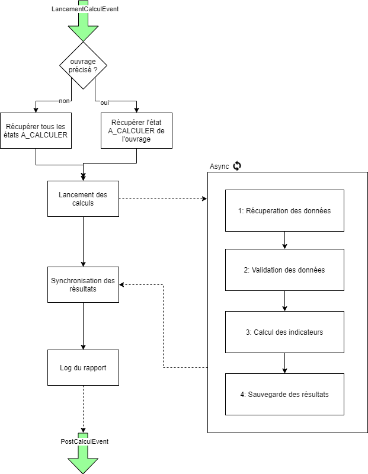

# Moteur de calcul des indicateurs locaux et globaux
Le module "calculateur" aussi appelé moteur de calcul est responsable du calcul de tous les indicateurs de l'application. Tous les résultats historisés (= stockés dans la base) doivent passer par lui. Il est appelé pendant le batch, après la récupération, la validation et l'enrichissement des données.

## Qu'est ce qu'on calcule ?
### Kpi locaux
Les KPI locaux sont des différences entre les valeurs de l'état de référence et l'état que l'on calcule actuellement. On transforme ces valeurs numériques en niveaux en fonction de seuils (voir [psu](politique_surveillance.md))

### MAC
La mac est une matrice. Chacune de ses cases est grosso modo un calcul d'écart entre les valeurs de tous les capteurs sur un mode de l'état de référence, et les valeurs de tous les capteurs sur un mode de l'état calculé. Cet écart est ramené entre 0 et 1. 1 étant bon, 0 étant éloigné.
La trace de la mac contient les seules données auxquelles on applique un Niveau. Elle correspond au mode n de l'état de ref, comparé au mode n de l'état actuel.

### COMAC
La comac est une matrice également. Comme la mac, chacune de ses cases correspond à un écart. Cette fois-ci l'écart se fait sur les valeurs d'un capteur pour tous les modes. Comme chaque capteur sont constants sur un ouvrage, cette matrice est en fait un vecteur.

Toutes les valeurs de la comac sont comparés à des seuils pour avoir un niveau affecté, mais à l'inverse de la mac, les "bonnes" valeurs sont proches de 0.

### Ratio gamma
Le ratio gamma est la dernière pièce du puzzle permettant de construire le kpi global. Il permet de faire en sorte que le kpi global soit un ratio entre 0 et 1.

### Kpi Global
Le KPI global est une moyenne pondérée de tous les kpi locaux, la trace de la mac, la comac. Le tout mélangé avec les différents ratios présentés dans la [PSU](politique_surveillance.md).

## D'où proviennent les données ?
Les données proviennent des tables `t_dnm_donnees_modes` et `t_dnc_donnees_capteurs`. Ces tables stockent les valeurs de chaque capteur pour chaque mode. Pour calculer un état, on récupère ces données pour l'état en question et pour l'état de référence de l'ouvrage.

On récupère également la politique de surveillance.

## Format des calculs
Pendant les calculs, les données sont arrondies après environ 20 chiffres après la virgule (c'est la limite de ce que l'on peut recevoir de la part de sercel). Par contre, ils sont enregistrés avec une précision moindre (en général, 4 chiffres après la virgule).

## De quoi doit-on se méfier ?
### Changement de nombre de mode d'un ouvrage.
Gros sujet ayant été volontairement laissé de côté pendant la phase de projet prise par le temps et le budget, un ouvrage peut changer de nombre de mode. Il faut s'attendre à avoir des modifications à apporter au calculateur à ce moment là.

## Annexes
### Diagramme

### Formules de calculs
[formules](../../latex/calculs.tex)
