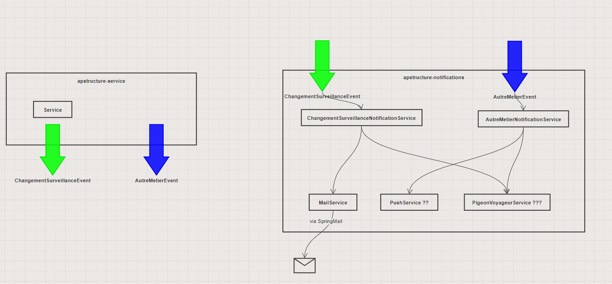

# Module des notifications

Le module des notifications de l'application est en charge d'envoyer des messages à l'extérieur de
l'application. Pour l'instant, seul un composant technique d'envoie de mail est implémenté (via
Spring Mail), mais le module est prévu pour accueillir d'autres solutions (push, pigeon voyageurs ?)
.

## Principes

Le module est composé de 2 parties:

- "application": Les composants techniques qui exécutent les notifications et gère le messaging
- "service": Les services métiers qui préparent les notifications avec les informations métier.

Toutes les notifications sont asynchrones, et depuis l'application, on "n'envoie pas de
notification", on "demande l'envoie du notification" via le messaging. L'application envoie un event
contenant uniquement les informations nécessaires et minimales (ex: l'id de l'ouvrage) pour que le
service dédié puisse constituer son contenu.

## Comment sont gérés les templates ?

Le système de mailing mis en place pour l'instant ne permet de gérer que des mails simples, en texte
brut (pas de besoin client pour mieux). Les templates de mail sont des fichiers properties, un par
mail, qui contiennent le sujet et le contenu du mail, avec des placeholder (ex: %DATE%). Les
placeholders sont remplacés par le service d'envoie de mail, en fournissant une map dont les clés sont les placeholders, et les valeurs sont ... les valeurs.

## Annexes
### Exemple de template
```properties
sujet=Passage de l’ouvrage d’art %REF_OUVRAGE% en mode de surveillance renforcé
contenu=%-----   ALERTE APStructure\n\
Date : %DATE%\n\
OA   : %REF_OUVRAGE%\n\
%--\n\
Etat structural estimé actuel : %KPI_G%\n\
%--\n\
Rappel:\n\
Seuil alarme changement état structural (=<): %SEUIL%\n\
%--\n\
Actions automatiques\n\
Augmentation de la fréquence de prises des mesures\n\
%--\n\
Actions conseillées\n\
Analyse des données par un ingénieur structure et prise de décisions (changement exploitation, investigations complémentaires à diligenter)
```

### Conception

