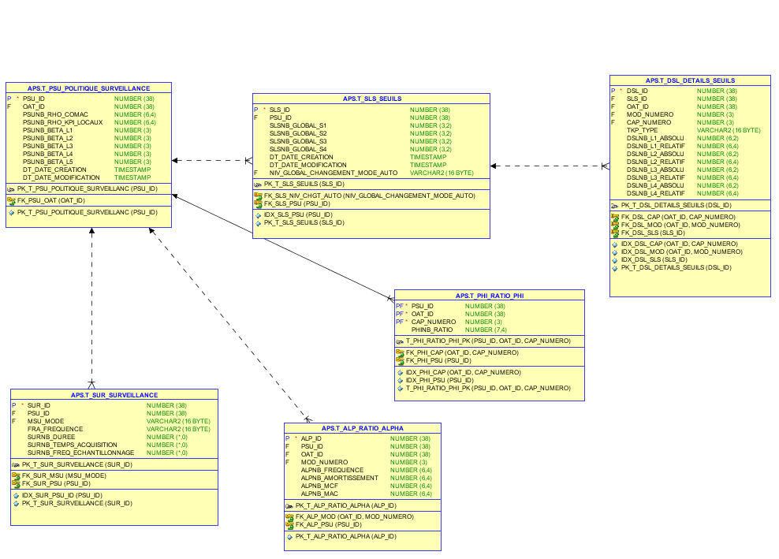

# Politique de surveillance

La politique de surveillance (PSU) est l'ensemble des configurations d'un ouvrage nécessaire au bon
calcul des indicateurs.

## Historisation

Pour des raisons juridiques, la politique de surveillance est historisée. Aussi, à l'enregistrement
de l'un de ses membre, toute la politique de surveillance est dupliquée, pour que l'ancienne version
reste en lien avec les états qu'elle a servi à calculer. A noter que si à l'enregistrement, la
politique en question n'a servi à aucun état, alors celle-ci est modifiée au lieu d'être dupliquée,
pour éviter de charger la base inutilement.

## Contenu

### Points de bases (ratio beta)

Les points de bases sont stockés directement dans la table de la politique de
surveillance `t_psu_politique_surveillance`. Ils correspondent à la valeur correspondante des
niveaux.

Exemple: un L1 vaut **2** points.

### Pondération des modes (ratios alphas)

La pondération des modes est stockée dans la table `t_alp_ratio_alpha`. Ces informations indique
que, pour un mode, un kpi local ou un autre a plus de valeur. On y trouve une ligne par mode par
psu. La somme des valeurs de chaque ligne doit toujours faire 1 (=100%).

Exemple: frequence: **45%**, amortissement: **5%**, mcf: **5%**, mac: **45%**

### Pondération des capteurs (ratios phis)

La pondération des capteurs est stockée dans la table `t_phi_ratio_phi`. Ces informations indique
l'importance des capteurs les uns par rapport aux autres. On y trouve une ligne par capteur par psu.
La somme des valeurs de toutes les lignes doit toujours faire 1 (=100%).

Exemple: capteur1: **34%**, capteur2: **33%**, capteur3: **33%**

### Pondération des kpi locaux (ratios rhos)

La pondération des kpi locaux représente la répartition dans le calcul du kpi global entre les
valeurs des kpi locaux et de la comac. Ces informations sont stockées directement dans la table de
la psu. La somme du rho kpi locaux et rho comac doit toujours faire 1 (=100%).

Exemple: rho kpi locaux: **80%**, rho comac: **20%**

### Seuils globaux

Les seuils globaux permettent de définir le niveau du kpi global. Ils sont stockés dans la table des
seuils `t_sls_seuils`. Pour être fonctionnels, ils doivent être progressifs (seuil L2 < seuil L3 <
seuil L4 < seuil L5).

Exemple: seuil L2: **0.2**, seuil L3: **0.4**, seuil L4: **0.6**, seuil L5: **0.8**

### Seuils des kpi locaux

Les seuils des kpi locaux permettent de définir le niveau des kpi locaux. Ils sont stockés dans la
table `t_dsl_details_seuils`. Ces seuils sont fonctions du type de KPI (frequence, amortissement,
mcf, mac et comac) et du mode ou du capteur. Dans le cas des seuils sur la comac, on renseigne le
numéro du capteur, pour tous les autres, le numéro du mode. Pour chacun de ces seuils, on renseigne
une valeur pour le mode de calcul absolu de l'ouvrage et une pour le mode de calcul relatif. Il y a
donc pour chaque psu: 4 x n + c lignes dans cette table (avec _n_ le nombre de modes et _c_ le
nombre de capteurs).

Exemple: Seuil du mode 1:

| Niveau | Absolu | Relatif |
|--|--|--|
| L2 | 0.2 | 0.05 (=5%) |
| L3 | 0.6 | 0.10 (=10%) |
| L4 | 1.2 |0.15 (=15%) |
| L5 | 1.8 | 0.20 (=20%) |

### Seuil de passage en mode renforcé

Le seuil de passage en mode renforcé est le seuil à partir duquel un ouvrage passe automatiquement
en mode de surveillance renforcé après le calcul du kpi global. Il est stocké dans la table des
seuils globaux.

Exemple: Niveau passage en mode renforcé <= **L2**

### Surveillance

La surveillance contient les informations concernant la prise de mesure sercel. Notamment la
fréquence à laquelle des mesure doivent être prises et pendant combien de temps. Egalement
l'échantillonage et la durée de prise de mesure. Elle est stockée dans la table `t_sur_surveillance`
et on y trouve systématiquement 2 lignes par psu: une pour le mode renforcé et une pour le mode
normal.

Exemple: Surveillance renforcée: Tous les jours, pendant 30 jours. Prise de mesure à 250 Hz, pendant
12 minutes.

## Annexes

### MPD de la PSU

